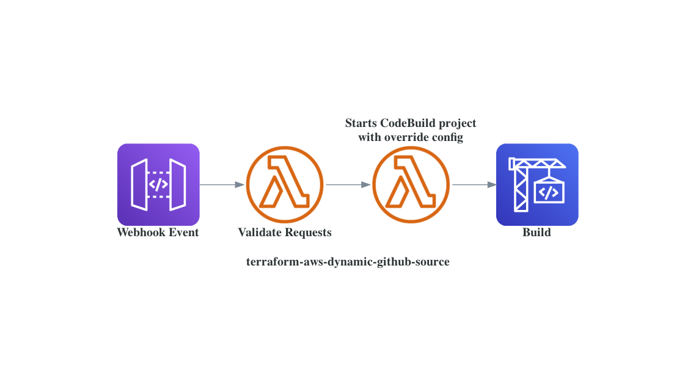

# dynamic-github-source

## Problem ##

Current implementation of AWS CodeBuild (as of: 6/19/21) doesn't allow for dynamic repo and branch source. CodeBuild does allow for up to 12 secondary sources, although the buildspec would have to have additional logic to explicitly switch to the secondary source that was trigger via the CodeBuild Webhook. Another painful workaround is to create a Codebuild project for each repository. If each repo requires the same CodeBuild configurations, this can lead to multiple copies of the same CodeBuild project but with different sources. This can consequently clutter your AWS CodeBuild workspace especially if there are hundreds of repositories are included in this process.

## Process ##



### Steps ###

1. Github event is performed (e.g. user pushes new file, opens PR, etc.) that falls under one of the repository's event filters
2. Github webhook sends a POST HTTP method request to the API Gateway's (AGW) REST API 
3. AGW request integration maps the request to a format friendly format `{'headers': <Webhook headers>, 'body': <Webhook payload>}` Processed request is passed to the request validator function.
4. Request validator function compares the `sha256` value from the request header with the `sha256` value created with the Github secret value and request payload. If the values are are not equal, then an error response is sent to the Github webhook. If the values are not equal, the Lambda function validates the payload against the filter groups defined for that repository. If the payload passes atleast one filter group, then the Lambda function succeeds invokes the next Lambda function asynchronously.
5. The second Lambda function triggers the Codebuild project with the repository's respective CodeBuild configurations ONLY for that build (after this build, CodeBuild project reverts to original configurations). The main attribute that is changed is the source configurations for the build which allow one CodeBuild to use a dynamic source.
6. CodeBuild performs the defined buildspec logic. User can define a global or repo-level buildspec that can be used for CI/CD, building AMIs, etc. 

## Non-Provider related Requirements
- The environment in which the Terraform module is applied must have pip within it's `$PATH`. The `resource "null_resource" "lambda_pip_deps" {}` installs the `PyGithub` package locally via `pip` and then is used within the payload validator function. 

## Usage

Minimal viable configuration:

```
module "dynamic_github_source" {
  source                         = "github.com/marshall7m/terraform-aws-dynamic-github-source"
  create_github_secret_ssm_param = true
  github_secret_ssm_value        = var.github_secret_ssm_value
  codebuild_buildspec            = file("buildspec.yaml")
  repos = {
    "test-repo" = {
      filter_groups = [
        [
          {
            type = "event"
            pattern = "push"
          }
        ]
      ]
    }
  }
}
```

Configure repo specific codebuild configurations via `codebuild_cfg` within `repos`:

```
module "dynamic_github_source" {
  source                         = "github.com/marshall7m/terraform-aws-dynamic-github-source"
  create_github_secret_ssm_param = true
  github_secret_ssm_value        = var.github_secret_ssm_value
  codebuild_name                 = "test-codebuild"
  codebuild_buildspec            = file("buildspec.yaml")
  repos = {
    "test-repo" = {
      codebuild_cfg = {
        environmentVariablesOverride = [
          {
            name  = "TEST"
            value = "FOO"
            type  = "PLAINTEXT"
          }
        ]
      }
      filter_groups = [
        [
          {
            type = "event"
            pattern = "push"
          },
          {
            type = "file_path"
            pattern = "CHANGELOG.md"
          }
        ],
        [
          {
            type = "event"
            pattern = "pull_request"
          },
          {
            type = "pr_action"
            pattern = "(opened|edited|synchronize)"
          },
          {
            type = "file_path"
            pattern = ".*\\.py$"
          },
          {
            type = "head_ref"
            pattern = "test-branch"
          }
        ]
      ]
    }
  }
}
```

<!-- BEGINNING OF PRE-COMMIT-TERRAFORM DOCS HOOK -->
## Requirements

| Name | Version |
|------|---------|
| <a name="requirement_terraform"></a> [terraform](#requirement\_terraform) | >=1.0.0 |
| <a name="requirement_aws"></a> [aws](#requirement\_aws) | >= 2.23 |
| <a name="requirement_github"></a> [github](#requirement\_github) | >= 4.4.0 |

## Providers

| Name | Version |
|------|---------|
| <a name="provider_aws"></a> [aws](#provider\_aws) | >= 2.23 |
| <a name="provider_local"></a> [local](#provider\_local) | n/a |

## Modules

| Name | Source | Version |
|------|--------|---------|
| <a name="module_codebuild"></a> [codebuild](#module\_codebuild) | github.com/marshall7m/terraform-aws-codebuild | v0.1.0 |
| <a name="module_github_webhook_request_validator"></a> [github\_webhook\_request\_validator](#module\_github\_webhook\_request\_validator) | github.com/marshall7m/terraform-aws-github-webhook | v0.1.4 |
| <a name="module_lambda_trigger_codebuild"></a> [lambda\_trigger\_codebuild](#module\_lambda\_trigger\_codebuild) | terraform-aws-modules/lambda/aws | 3.3.1 |

## Resources

| Name | Type |
|------|------|
| [aws_iam_policy.lambda](https://registry.terraform.io/providers/hashicorp/aws/latest/docs/resources/iam_policy) | resource |
| [local_file.repo_cfg](https://registry.terraform.io/providers/hashicorp/local/latest/docs/resources/file) | resource |
| [aws_iam_policy_document.lambda](https://registry.terraform.io/providers/hashicorp/aws/latest/docs/data-sources/iam_policy_document) | data source |

## Inputs

| Name | Description | Type | Default | Required |
|------|-------------|------|---------|:--------:|
| <a name="input_api_description"></a> [api\_description](#input\_api\_description) | Description for API-Gateway | `string` | `null` | no |
| <a name="input_api_name"></a> [api\_name](#input\_api\_name) | Name of API-Gateway | `string` | `"github-webhook"` | no |
| <a name="input_codebuild_artifacts"></a> [codebuild\_artifacts](#input\_codebuild\_artifacts) | Build project's primary output artifacts configuration<br>see for more info: https://registry.terraform.io/providers/hashicorp/aws/latest/docs/resources/codebuild_project#argument-reference | <pre>object({<br>    type                   = optional(string)<br>    artifact_identifier    = optional(string)<br>    encryption_disabled    = optional(bool)<br>    override_artifact_name = optional(bool)<br>    location               = optional(string)<br>    name                   = optional(string)<br>    namespace_type         = optional(string)<br>    packaging              = optional(string)<br>    path                   = optional(string)<br>  })</pre> | `{}` | no |
| <a name="input_codebuild_assumable_role_arns"></a> [codebuild\_assumable\_role\_arns](#input\_codebuild\_assumable\_role\_arns) | List of IAM role ARNS the Codebuild project can assume | `list(string)` | `[]` | no |
| <a name="input_codebuild_buildspec"></a> [codebuild\_buildspec](#input\_codebuild\_buildspec) | Content of the default buildspec file | `string` | `null` | no |
| <a name="input_codebuild_cache"></a> [codebuild\_cache](#input\_codebuild\_cache) | Cache configuration for Codebuild project | <pre>object({<br>    type     = optional(string)<br>    location = optional(string)<br>    modes    = optional(list(string))<br>  })</pre> | `{}` | no |
| <a name="input_codebuild_create_source_auth"></a> [codebuild\_create\_source\_auth](#input\_codebuild\_create\_source\_auth) | Determines if a CodeBuild source credential resource should be created. Only one credential<br>resource is needed/allowed per AWS account and region. See more at: https://docs.aws.amazon.com/cdk/api/v2/docs/aws-cdk-lib.aws_codebuild.GitHubSourceCredentials.html | `bool` | `false` | no |
| <a name="input_codebuild_cw_group_name"></a> [codebuild\_cw\_group\_name](#input\_codebuild\_cw\_group\_name) | CloudWatch group name | `string` | `null` | no |
| <a name="input_codebuild_cw_stream_name"></a> [codebuild\_cw\_stream\_name](#input\_codebuild\_cw\_stream\_name) | CloudWatch stream name | `string` | `null` | no |
| <a name="input_codebuild_description"></a> [codebuild\_description](#input\_codebuild\_description) | CodeBuild project description | `string` | `null` | no |
| <a name="input_codebuild_environment"></a> [codebuild\_environment](#input\_codebuild\_environment) | Codebuild environment configuration | <pre>object({<br>    compute_type                = optional(string)<br>    image                       = optional(string)<br>    type                        = optional(string)<br>    image_pull_credentials_type = optional(string)<br>    environment_variables = optional(list(object({<br>      name  = string<br>      value = string<br>      type  = optional(string)<br>    })))<br>    privileged_mode = optional(bool)<br>    certificate     = optional(string)<br>    registry_credential = optional(object({<br>      credential          = optional(string)<br>      credential_provider = optional(string)<br>    }))<br>  })</pre> | `{}` | no |
| <a name="input_codebuild_name"></a> [codebuild\_name](#input\_codebuild\_name) | Name of Codebuild project | `string` | `"dynamic-github-source-build"` | no |
| <a name="input_codebuild_role_arn"></a> [codebuild\_role\_arn](#input\_codebuild\_role\_arn) | Existing IAM role ARN to attach to CodeBuild project | `string` | `null` | no |
| <a name="input_codebuild_role_policy_statements"></a> [codebuild\_role\_policy\_statements](#input\_codebuild\_role\_policy\_statements) | IAM policy statements to add to CodeBuild project's role | <pre>list(object({<br>    sid       = optional(string)<br>    effect    = string<br>    actions   = list(string)<br>    resources = list(string)<br>  }))</pre> | `[]` | no |
| <a name="input_codebuild_s3_log_bucket"></a> [codebuild\_s3\_log\_bucket](#input\_codebuild\_s3\_log\_bucket) | Name of S3 bucket where the build project's logs will be stored | `string` | `null` | no |
| <a name="input_codebuild_s3_log_encryption"></a> [codebuild\_s3\_log\_encryption](#input\_codebuild\_s3\_log\_encryption) | Determines if encryption should be disabled for the build project's S3 logs | `bool` | `false` | no |
| <a name="input_codebuild_s3_log_key"></a> [codebuild\_s3\_log\_key](#input\_codebuild\_s3\_log\_key) | Bucket path where the build project's logs will be stored (don't include bucket name) | `string` | `null` | no |
| <a name="input_codebuild_secondary_artifacts"></a> [codebuild\_secondary\_artifacts](#input\_codebuild\_secondary\_artifacts) | Build project's secondary output artifacts configuration | <pre>object({<br>    type                   = optional(string)<br>    artifact_identifier    = optional(string)<br>    encryption_disabled    = optional(bool)<br>    override_artifact_name = optional(bool)<br>    location               = optional(string)<br>    name                   = optional(string)<br>    namespace_type         = optional(string)<br>    packaging              = optional(string)<br>    path                   = optional(string)<br>  })</pre> | `{}` | no |
| <a name="input_codebuild_source_auth_token"></a> [codebuild\_source\_auth\_token](#input\_codebuild\_source\_auth\_token) | GitHub personal access token used to authorize CodeBuild projects to clone GitHub repos within the Terraform AWS provider's AWS account and region. <br>  If not specified, existing CodeBuild OAUTH or GitHub personal access token authorization is required beforehand. | `string` | `null` | no |
| <a name="input_codebuild_tags"></a> [codebuild\_tags](#input\_codebuild\_tags) | Tags to attach to Codebuild project | `map(string)` | `{}` | no |
| <a name="input_codebuild_timeout"></a> [codebuild\_timeout](#input\_codebuild\_timeout) | Minutes till build run is timed out | `string` | `null` | no |
| <a name="input_common_tags"></a> [common\_tags](#input\_common\_tags) | Tags to add to all resources | `map(string)` | `{}` | no |
| <a name="input_enable_codebuild_cw_logs"></a> [enable\_codebuild\_cw\_logs](#input\_enable\_codebuild\_cw\_logs) | Determines if CloudWatch logs should be enabled | `bool` | `true` | no |
| <a name="input_enable_codebuild_s3_logs"></a> [enable\_codebuild\_s3\_logs](#input\_enable\_codebuild\_s3\_logs) | Determines if S3 logs should be enabled | `bool` | `false` | no |
| <a name="input_github_secret_ssm_description"></a> [github\_secret\_ssm\_description](#input\_github\_secret\_ssm\_description) | Github secret SSM parameter description | `string` | `"Secret value for Github Webhooks"` | no |
| <a name="input_github_secret_ssm_key"></a> [github\_secret\_ssm\_key](#input\_github\_secret\_ssm\_key) | SSM parameter store key for github webhook secret. Secret used within Lambda function for Github request validation. | `string` | `"github-webhook-secret"` | no |
| <a name="input_github_secret_ssm_tags"></a> [github\_secret\_ssm\_tags](#input\_github\_secret\_ssm\_tags) | Tags for Github webhook secret SSM parameter | `map(string)` | `{}` | no |
| <a name="input_lambda_trigger_codebuild_function_name"></a> [lambda\_trigger\_codebuild\_function\_name](#input\_lambda\_trigger\_codebuild\_function\_name) | Name of AWS Lambda function that will start the AWS CodeBuild with the override configurations | `string` | `"dynamic-github-source-build-trigger"` | no |
| <a name="input_repos"></a> [repos](#input\_repos) | Map of keys with GitHub repo names and values representing their respective filter groups used to select<br>what type of activities will trigger the associated Codebuild project.<br>Params:<br>  {<br>    <repo full name (e.g user/repo)> : {<br>      `filter_groups`: List of filter groups that the Github activity has to meet. The activity has to meet all filters of atleast one group in order to succeed. <br>        [<br>          [ (Filter Group)<br>            {<br>              `type`: The type of filter<br>                (<br>                  `event` - List of Github Webhook events that will invoke the API. Currently only supports: `push` and `pull_request`.<br>                  `pr_actions` - List of pull request actions (e.g. opened, edited, reopened, closed). See more under the action key at: https://docs.github.com/en/developers/webhooks-and-events/webhook-events-and-payloads#pull_request<br>                  `base_refs` - List of base refs<br>                  `head_refs` - List of head refs<br>                  `actor_account_ids` - List of Github user IDs<br>                  `commit_messages` - List of commit messages<br>                  `file_paths` - List of file paths<br>                )<br>              `pattern`: Regex pattern that is searched for within the activity's related payload attribute. For `type` = `event`, use a single Github webhook event and not a regex pattern.<br>              `exclude_matched_filter` - If set to true, labels filter group as invalid if matched<br>            }<br>          ]<br>        ]<br>      `codebuild_cfg`: CodeBuild configurations used specifically for the repository. See AWS docs for details: https://docs.aws.amazon.com/codebuild/latest/APIReference/API_StartBuild.html<br>    } | <pre>map(object({<br><br>    filter_groups = optional(list(list(object({<br>      type                   = string<br>      pattern                = string<br>      exclude_matched_filter = optional(bool)<br>    }))))<br><br>    codebuild_cfg = optional(any)<br>  }))</pre> | `{}` | no |

## Outputs

| Name | Description |
|------|-------------|
| <a name="output_api_deployment_invoke_url"></a> [api\_deployment\_invoke\_url](#output\_api\_deployment\_invoke\_url) | API invoke URL the github webhook will ping |
| <a name="output_codebuild_arn"></a> [codebuild\_arn](#output\_codebuild\_arn) | ARN of the CodeBuild project will be conditionally triggered from the payload validator Lambda function |
| <a name="output_request_validator_agw_cw_log_group_name"></a> [request\_validator\_agw\_cw\_log\_group\_name](#output\_request\_validator\_agw\_cw\_log\_group\_name) | Name of the CloudWatch log group associated with the API gateway |
| <a name="output_request_validator_cw_log_group_arn"></a> [request\_validator\_cw\_log\_group\_arn](#output\_request\_validator\_cw\_log\_group\_arn) | ARN of the Cloudwatch log group associated with the Lambda function that validates the incoming requests |
| <a name="output_request_validator_function_arn"></a> [request\_validator\_function\_arn](#output\_request\_validator\_function\_arn) | ARN of the Lambda function that validates incoming requests |
| <a name="output_request_validator_function_name"></a> [request\_validator\_function\_name](#output\_request\_validator\_function\_name) | Name of the Cloudwatch log group associated with the Lambda function that validates the incoming requests |
| <a name="output_trigger_codebuild_cw_log_group_arn"></a> [trigger\_codebuild\_cw\_log\_group\_arn](#output\_trigger\_codebuild\_cw\_log\_group\_arn) | ARN of the Cloudwatch log group associated with the Lambda function that triggers the downstream CodeBuild project |
| <a name="output_trigger_codebuild_cw_log_group_name"></a> [trigger\_codebuild\_cw\_log\_group\_name](#output\_trigger\_codebuild\_cw\_log\_group\_name) | Name of the Cloudwatch log group associated with the Lambda function that triggers the downstream CodeBuild project |
| <a name="output_trigger_codebuild_function_arn"></a> [trigger\_codebuild\_function\_arn](#output\_trigger\_codebuild\_function\_arn) | ARN of the Lambda function that triggers the downstream CodeBuild project with repo specific configurations |
| <a name="output_trigger_codebuild_function_name"></a> [trigger\_codebuild\_function\_name](#output\_trigger\_codebuild\_function\_name) | Name of the Lambda function that triggers the downstream CodeBuild project with repo specific configurations |
<!-- END OF PRE-COMMIT-TERRAFORM DOCS HOOK -->